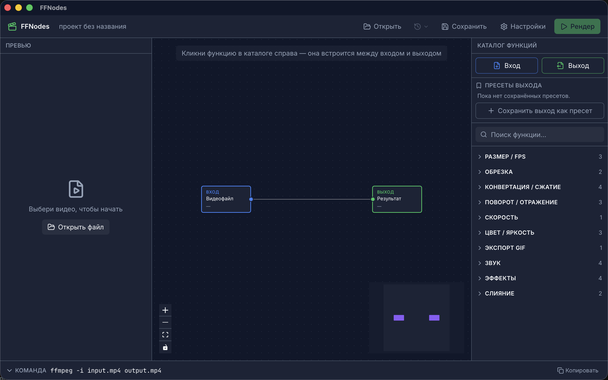

# 🎬 FFNodes

**FFNodes — a visual, node-based editor for FFmpeg.**

         

Open-source визуальный нодовый редактор поверх FFmpeg.
Закидываешь медиа → собираешь пайплайн из нод и функций с человеческими описаниями «что это и зачем» → видишь сгенерированную FFmpeg-команду внизу (её можно читать и править) → рендеришь и смотришь результат. Никаких длинных команд наизусть — но и ничего не спрятано от тех, кто хочет видеть всё.

---

## 🖼 Скриншот



> Скриншот главного окна: превью результата, нодовый холст и каталог функций, под ними — сгенерированная FFmpeg-команда.

---

## 🎯 Цель продукта

Дать любому человеку доступ ко всей мощи FFmpeg без необходимости запоминать длинные команды — и одновременно научить понимать, что происходит «под капотом». Инструмент, на котором наглядно изучаешь все возможности FFmpeg.

---

## 👤 Целевая аудитория

Двойная, объединённая одним интерфейсом по принципу **прогрессивного раскрытия**:

- **Новички, боящиеся CLI** — работают кнопками, нодами и пресетами; команду можно не видеть.
- **Профи, знающие FFmpeg** — устали писать длинный `-filter_complex` руками; команда видна и редактируема.

Полное продуктовое описание — [docs/PRD.md](docs/PRD.md).

---

## ✨ Что уже умеет

- **Полный цикл рендера** — файл → пайплайн нод → запуск FFmpeg с потоковым прогрессом и отменой → результат.
- **Каталог из 29 операций** — размер/fps, обрезка, поворот/отражение, скорость, цвет/яркость, конвертация/сжатие, GIF, звук, эффекты, слияние.
- **Нодовый холст** — линейная цепочка и сложные DAG-графы (несколько входов, ветвление, слияние через `filter_complex`).
- **Мульти-аутпут** — один вход → несколько выходов одной командой.
- **Превью «До → После»** — реальный кадр и предсказанные характеристики (разрешение, fps, кодек, размер).
- **Валидация** — несочетаемые операции подсвечиваются и блокируют рендер.
- **Проекты и пресеты** — сохранение/загрузка `.ffvproj`, пресеты выходной ветки, список недавних проектов.

История изменений — [CHANGELOG.md](CHANGELOG.md).

---

## 📦 Стек

| Слой | Технология |
|---|---|
| Оболочка десктопа | Tauri (кроссплатформа Mac/Win/Linux, лёгкая, быстрая) |
| Фронтенд | React 19 + TypeScript strict |
| Нодовый холст | React Flow (xyflow) |
| Стилизация | Tailwind CSS |
| Сборка | Vite |
| Исполнение | FFmpeg (системный или бандленный бинарник) |

Python **не используется** — отклонён осознанно (обоснование в [docs/PRD.md](docs/PRD.md) §5).

---

## 📁 Структура проекта

```
FFmpeg_visual/
├── src/                   # Фронтенд (Feature-Sliced Design)
│   ├── app/               # точка входа, провайдеры, тема
│   ├── widgets/           # NodeCanvas, PreviewPanel, FilterCatalog, CommandBar, TopBar
│   ├── features/          # add-node, edit-params, run-render…
│   └── shared/            # types/, lib/ffmpeg/, api/, ui/
├── src-tauri/             # Rust: run_ffmpeg, probe_media, extract_frame, projects…
├── docs/                  # Документация (PRD, ARCHITECTURE, WORKFLOW, UI, IDEAS…)
│   └── assets/            # скриншоты для README
├── tests/                 # реестр покрытия (сами тесты — рядом с кодом)
├── CHANGELOG.md           # история завершённого
├── CLAUDE.md              # память Claude Code: контекст, стек, правила
└── README.md              # этот файл
```

---

## 🗺 Раскладка интерфейса

```
┌──────────────┬────────────────────────────┬──────────────┐
│              │                            │              │
│   Превью     │     Нодовый холст          │   Каталог    │
│  результата  │  (input → filter → output) │   функций    │
│              │                            │ с описаниями │
├──────────────┴────────────────────────────┴──────────────┤
│  $ ffmpeg -i in.mp4 -vf "scale=..." out.mp4   [Рендер]    │
│  (сгенерированная команда — видна и редактируема)         │
└───────────────────────────────────────────────────────────┘
```

---

## 🛠 Запуск локально

```bash
git clone <repo-url>
cd FFmpeg_visual
npm install
npm run tauri dev     # запуск десктоп-приложения в dev-режиме
npm run dev           # только фронтенд (без Tauri)
npm test              # vitest
npm run build         # production-сборка фронтенда
npm run tauri build   # сборка установщиков под текущую ОС
```

Тесты Rust — `cargo test` в `src-tauri/`.

Требуется установленный **FFmpeg** в системе (или будет бандлиться в приложение — решится на этапе сборки).

---

## 🤝 Вклад

Проект open-source. Порядок работы над кодом описан в [docs/WORKFLOW.md](docs/WORKFLOW.md).
</content>
</invoke>
